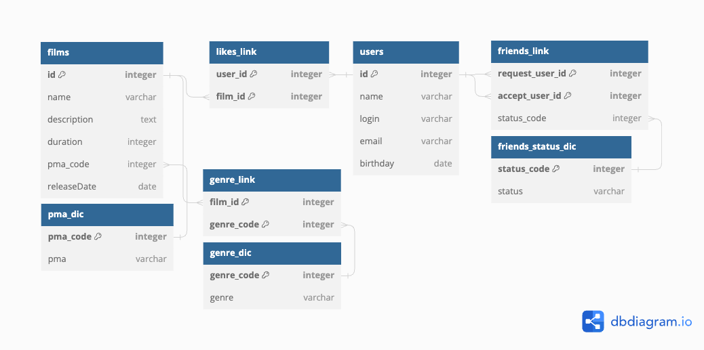
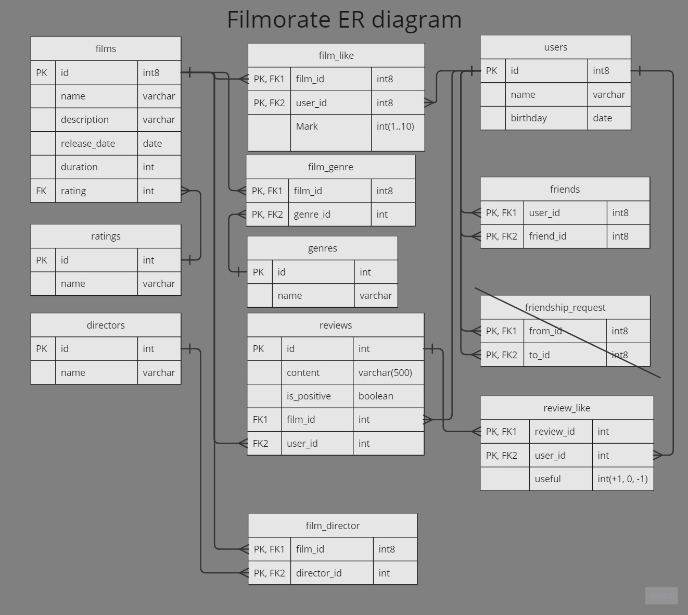

# filmorate
Фильмов много — и с каждым годом становится всё больше. Чем их больше, тем больше разных оценок. 
Чем больше оценок, тем сложнее сделать выбор.

## _Описание проекта_
Приложение представляет собой бекэнд сервиса для работы с пользователями и фильмамы. 
Позволяет:
* добавлять/изменять/удалять пользователей, фильмы, режиссеров, отзывы
* добавлять/принимать пользователей в друзья
* лайкать понравившиеся фильмы, ставить дизлайки
* оставлять отзывы к фильмам
* ставить/удалять лайки/дизлайки на отзывы
* получать пользователей/фильмы/жанры/рейтинг MPA, режиссеров, отзывы
* получать список рекомендуемых фильмов по предпочтениям пользователей с аналогичными вкусами
* получать список наиболее популярных фильмов
* получать список фильмов по режиссеру
* искать фильмы по назанию и/или режиссеру
* получать список друзей
* получать список общих друзей
* получать список событий

Расширенная версия проекта представлена в ветке **group-project**.

## _Используемые HTTP-методы_

| Метод  | Описание                                          |
|--------|---------------------------------------------------|
| GET    | Get users, films, directors, reviews, genres, mpa |
| POST   | Post users, films, directors, reviews             |
| PUT    | Update , films, directors, reviews, likes         |
| DELETE | users, films, directors, reviews, likes           |

## Возможные коды HTTP-ответов

| Код  | Описание                       |
|------|--------------------------------|
| 200  | OK                             |
| 400  | Некорректный запрос            |
| 404  | Не найдено                     |
| 500  | Внутренняя ошибка сервера      |

## _End points_

> Контроллер пользователей

| Метод  | URL                                  | Описание                              | Параметры                                          |
|--------|--------------------------------------|---------------------------------------|----------------------------------------------------|
| GET    | /users                               | Получить список всех пользователей    | n/a                                                |
|        | /users/{id}                          | Получить пользователя по id           | id > 0                                             |
|        | /users/{id}/friends/common/{otherId} | Получить список общих друзей          | id > 0, otherId > 0                                |
|        | /users/{id}/friends                  | Получить друзей пользователя          | id > 0                                             |
|        | /users/{id}/recommendations          | Получить список рекомендуемых фильмов | id > 0                                             |
|        | /users/{id}/feed                     | Получить список событий               | id > 0                                             |
| POST   | /users                               | Создать пользователя                  | требуется json body (correct email, not blank name)|
|        | /users/{id}/friends/{friendId}       | Добавить пользователя в друзья        | id > 0, friendId > 0                               |
| PUT    | /users                               | Изменить информацию о пользователе    | требуется json body (correct email, not blank name)|
|        | /users/{id}/friends/{friendId}       | Принять пользователя в друзья         | id > 0, friendId > 0                               |
| DELETE | /users/{id}                          | Удалить пользователя по id            | id > 0                                             |
|        | /users/{id}/friends/{friendId}       | Удалить пользователя из друзей        | id > 0, friendId > 0                               |

> Контроллер фильмов <br>

| Метод  | URL                                  | Описание                              | Параметры                                         |
|--------|--------------------------------------|---------------------------------------|---------------------------------------------------|
| GET    | /films                               | Получить список всех фильмов          | n/a                                               |
|        | /films/{id}                          | Получить фильм по id                  | id > 0                                            |
|        | /films/common                        | Получить список общих фильмов         | id > 0, friendId > 0                              |
|        | /films/popular                       | Получить список популярных фильмов    | count > 0 (по умолчанию 10), genreId > 0 (необязательный), year (необязательный) |
|        | /films/director/{directorId}         | Получить список фильмов по режиссеру  | directorId > 0, sortBy (year, likes)              |
|        | /films/search                        | Получить список событий               | query - строка для поиска, by - по названию (title), по режиссеру (director) |
| POST   | /films                               | Создать фильм                         | требуется json body                               |
| PUT    | /films                               | Изменить информацию о фильме          | требуется json body                               |
|        | /{id}/like/{userId}                  | Добавить лайк фильму                  | id > 0, userId > 0                                |
| DELETE | /films/{id}                          | Удалить фильм по id                   | id > 0                                            |
|        | /films/{id}/like/{userId}            | Удалить лайк на фильм                 | id > 0, userId > 0                                |

> Контроллер жанров <br>

| Метод  | URL                        | Описание                      | Параметры                                         |
|--------|----------------------------|-------------------------------|---------------------------------------------------|
| GET    | /genres                    | Получить список всех жанров   | n/a                                               |
|        | /genres/{id}               | Получить жанр по id           | id > 0                                            |

> Контроллер рейтингов MPA <br>

| Метод  | URL                        | Описание                       | Параметры                                         |
|--------|----------------------------|--------------------------------|---------------------------------------------------|
| GET    | /mpa                       | Получить список всех рейтингов | n/a                                               |
|        | /mpa/{id}                  | Получить рейтинг по id         | id > 0                                            |

> Контроллер режиссеров <br>

| Метод  | URL                                  | Описание                              | Параметры                                          |
|--------|--------------------------------------|---------------------------------------|----------------------------------------------------|
| GET    | /directors                           | Получить список всех рижиссеров       | n/a                                                |
|        | /directors/{id}                      | Получить режиссера по id              | id > 0                                             |
| POST   | /directors                           | Добавить режиссера                    | требуется json body                                |
| PUT    | /directors                           | Изменить информацию о режиссере       | требуется json body                                |
| DELETE | /directors/{id}                      | Удалить режиссера по id               | id > 0                                             |

> Контроллер отзывов <br>

| Метод  | URL                            | Описание                              | Параметры                                         |
|--------|--------------------------------|---------------------------------------|---------------------------------------------------|
| GET    | /reviews                       | Получить список отзывов по id фильма  | filmId > 0, count (по умолчанию 10)               |
|        | /reviews/{id}                  | Получить отзыв по id                  | id > 0                                            |
| POST   | /reviews                       | Создать фильм                         | требуется json body                               |
| PUT    | /reviews                       | Изменить информацию о фильме          | требуется json body                               |
|        | /reviews/{id}/like/{userId}    | Добавить лайк на отзыв                | id > 0, userId > 0                                | 
|        | /reviews/{id}/dislike/{userId} | Добавить дизлайк на отзыв             | id > 0, userId > 0                                | 
| DELETE | /reviews/{id}                  | Удалить отзыв по id                   | id > 0                                            |
|        | /reviews/{id}/like/{userId}    | Удалить лайк на отзыв                 | id > 0, userId > 0                                |
|        | /reviews/{id}/dislike/{userId} | Удалить дизлайк на отзыв              | id > 0, userId > 0                                |

## _Технологии проекта_

> Spring boot 2.14.0<br>
> JDBC Template
> Java version 11

## _База данных_

> PostgreSQL версия 14<br>
 
## Схема базы данных (упрощенная версия):


## Схема базы данных (расширенная версия):
 
 
#### Примеры запросов к БД:

### Добавить новый фильм
``` 
insert into films(name, description, duration, mpa_code, release_date)
values('Гараж', 'На заседании гаражного кооператива предстоит выбрать четырех «крайних», которые должны сами отказаться от будущего собственного гаража.',
96, 1, '30.11.1979')
```

### Получить список друзей пользователя
 ```
 select u.* 
 from friends_link fl join users u on fl.request_user_id = u.id 
 where fl.accept_user_id = 1 
   and fl.status_code = 2
 ```

### Принять запрос в друзья 
``` 
update friends_link 
set status_code = 2 
where request_user_id = 1 
  and accept_user_id = 2
```

### Получить список 10 самых популярных фильмов
``` 
select f.* 
from films f left join (select ll.film_id, count(ll.user_id) cnt from likes_link ll group by ll.film_id) l on f.id = l.film_id 
order by l.cnt desc 
limit 10
```
